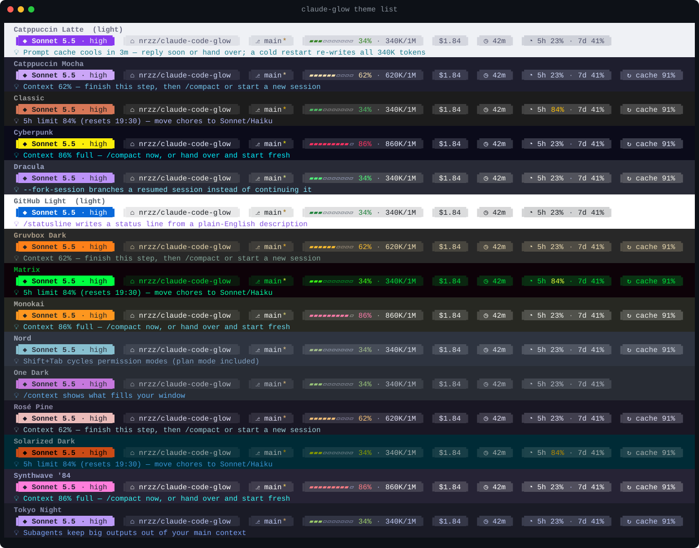

# Claude Code Glow

[](https://github.com/nrzz/claude-code-glow/actions/workflows/test.yml) [](LICENSE)   [](https://github.com/nrzz/claude-code-toolkit)

Make Claude Code look the way you like, and spend fewer tokens while you are at it: a status line that shows what matters and tells you when to compact, in 15 themes (14 of which also recolor the whole interface; `classic` keeps Claude's own colors), and a live bar with one-key buttons. Everything the status line, themes and HUD show stays on your screen. None of it is sent to the model, so its tips cost zero tokens.



## What it costs in tokens

Almost nothing, by design:

| Part | Tokens | |
| --- | --- | --- |
| Themes for the whole interface | 0 | Colors only |
| The status line and its tips | 0 | Claude Code draws it under the prompt and never sends it to the model |
| The HUD: bar, picker, toasts, `/glow` | 0 | Drawn by the plugin; `/glow` leaves nothing in the conversation |
| Skills in Claude's skill list | 0 | All three are user-only (`disable-model-invocation`), and Claude Code leaves user-only skills out of the list it gives the model. `claude plugin details` still shows about 30 tokens always-on for their one-line descriptions: that is Claude Code's own estimate, for descriptions the model never actually sees |
| `/glowline:theme`, `/glowline:setup`, `/glowline:doctor` | one short turn each | Free routes: `/theme`, `/glow` (HUD), and `claude-glow ...` in a terminal |

And it helps you spend less: the tips and toasts tell you when the context is filling up, when the prompt cache is about to go cold, when a plan limit is near, and when a big file was read whole.

## Install

**As a Claude Code plugin** (recommended). In Claude Code:

```text
/plugin marketplace add nrzz/claude-code-glow
/plugin install glowline@claude-code-glow
/glowline:setup
```

Then run `/theme` once and pick **Glow (live)**. That is the theme Glow rewrites whenever you switch, so from then on every switch recolors the whole interface at once.

Optional, early access: `/plugin install glowbar@claude-code-glow` adds the live bar above the prompt (the HUD) and the `/glow` picker (Claude Code 2.1.286 or newer, terminal and desktop app).

The two plugins were called `glow` and `glow-hud` until 1.0.2. If you installed them under those names, run `/plugin uninstall glow@claude-code-glow` (and `glow-hud@claude-code-glow`), then install `glowline` (and `glowbar`). The commands, the themes and your settings stay the same.

**From a terminal**, with Node 18 or newer:

```bash
npx -y github:nrzz/claude-code-glow install
```

Same result as `/glowline:setup`. In your `settings.json` only the `statusLine` key changes, and every other key keeps its value. But whenever the install changes an existing file, it first saves a copy next to it as `settings.json.bak-glow-<timestamp>`, and it writes the file back with 2-space indentation, so a file formatted another way is reflowed.

## Themes

| Theme | Base | | Theme | Base |
| --- | --- | --- | --- | --- |
| `classic` (Claude's own colors, status line only) | dark | | `one-dark` | dark |
| `synthwave-84` | dark | | `monokai` | dark |
| `dracula` | dark | | `matrix` | dark |
| `tokyo-night` | dark | | `cyberpunk` | dark |
| `catppuccin-mocha` | dark | | `solarized-dark` | dark |
| `nord` | dark | | `catppuccin-latte` | light |
| `gruvbox-dark` | dark | | `github-light` | light |
| `rose-pine` | dark | | | |

Switch whenever you like:

| Where | How |
| --- | --- |
| A terminal | `claude-glow theme` opens a full-screen picker with a live preview (arrows, Enter). `claude-glow theme set nord` switches at once |
| Claude Code, with the plugin | `/glowline:theme dracula` |
| Claude Code, with the HUD | `/glow`, then press the theme's key, or `/glow tokyo-night` |
| Claude Code's own picker | `/theme` lists the 14 interface themes as "Glow · Name" (`classic` themes only the status line, so it is not listed) |

How the instant switch works: Claude Code reads custom themes from `~/.claude/themes/` and watches that folder. The install writes one file there for each of the 14 interface themes, `glow-<slug>.json`, plus the live file `glow.json` ("Glow (live)"), which Glow rewrites on every switch. Each of the 14 sets all 71 color keys Claude Code has, from the prompt border and Claude's accent to diff backgrounds, plan-mode labels and the spinner shimmer. `classic` sets none of them: it keeps Claude's own colors and themes the status line only. Light themes want a light terminal background.

## The status line

Two lines under the prompt:

1. Model and effort, folder, git branch, a context meter that turns from green to amber to red, session cost and time, your 5-hour and weekly plan limits, and the prompt cache's hit ratio with a countdown when it is about to go cold.
2. One tip.

The branch gets a `*` when the folder has uncommitted changes. To keep a big repository fast, the status line runs `git status` at most once every 5 seconds per folder, gives up after 300 ms, and keeps the answer in a tiny file in your system's temp folder (`claude-glow-git-<hash>.json`: when it last checked, and whether there were changes). That is the only file the status line writes.

Icons come in three styles: `unicode` (the default, any font), `nerd` (Powerline arrows and icons, needs a Nerd Font) and `ascii`. Change with `claude-glow icons nerd`.

### Tips that save tokens

The status line is never sent to the model, so every tip is free. The first rule that matches wins:

| When | The tip says |
| --- | --- |
| Context 80% or more | Compact now, or hand over and start fresh |
| Context 50% or more | Finish this step, then compact or start a new session |
| The prompt cache cools within 5 minutes | Reply soon or hand over: a cold restart re-writes the whole context |
| The prompt cache is cold | The next message re-sends everything at full price; a fresh session is cheaper |
| A plan limit at 80% or more | Move chores to Sonnet or Haiku |
| Effort set to max | Max overthinks routine work; try high |
| Over 200K tokens | Long contexts cost more per message |
| Otherwise | A rotating Claude Code feature tip (Esc Esc rewinds, Shift+Tab cycles modes, ...) |

Turn the tip line off with `claude-glow tips off`.

## The HUD

The `glowbar` plugin draws a bar above the prompt, in the terminal and in the desktop app:

```text
◆ glow  ▰▰▰▰▰▰▱▱▱▱ 62%  620K/1M  5h 84%  7d 41%  $3.50  💡 Past half the context: finish this step, then compact…  [ Compact ] [ Theme ] ×
```

- **c** compacts (the button shows at 50% and above, while Claude is not working), **t** opens the theme picker, **h** hides the bar (`/glow hud` brings it back).
- A toast appears once when the context passes 50% and 80%, when a plan limit passes 80%, and when a large file was read whole, with what it costs on every later message.
- `/glow` opens the picker; `/glow nord` applies a theme straight away.
- The bar draws with Claude Code's own theme colors, so it follows whatever theme is active.

It is built on Claude Code's function hooks, an early-access API that may change between releases. If an update ever breaks it, disable `glowbar`; nothing else in Glow depends on it.

## Token doctor

```bash
claude-glow doctor
```

Or `/glowline:doctor` in Claude Code. It reads only configuration files, never your conversations: how many tokens your `CLAUDE.md` files and their imports put into every session; the descriptions of the skills in your user and project `skills` folders (user-only skills show as 0 tokens, because Claude Code leaves them out of the list it gives the model); the MCP server names in the project's `.mcp.json` and in the top level of your user `.claude.json` (servers stored per project inside that file, and servers that plugins bring, are not counted); and settings such as effort `max` or a missing cheaper model for subagents. Each finding comes with the fix. The `CLAUDE.md`, skills and MCP findings also estimate what the fix saves per session; the effort, subagent-model and status-line findings give no figure.

## Cheat sheet

```bash
claude-glow cheatsheet
```

One colorful screen of Claude Code keys, slash commands, CLI flags and token-saving habits.

## All commands

```text
claude-glow install [--theme <slug>] [--icons nerd|unicode|ascii] [--no-ui-theme] [--dry-run]
claude-glow uninstall [--dry-run]
claude-glow theme                    interactive picker with a live preview
claude-glow theme set <slug>
claude-glow theme list
claude-glow preview [--theme <slug>] [--json <file>|-]
claude-glow icons <nerd|unicode|ascii>
claude-glow tips <on|off>
claude-glow cheatsheet
claude-glow doctor [--project <dir>]
```

`claude-glow` means `node ~/.claude/claude-code-glow/bin/claude-glow.mjs` after an install, or `npx -y github:nrzz/claude-code-glow <command>` anywhere. Everything honours `CLAUDE_CONFIG_DIR`. `NO_COLOR` and `GLOW_COLOR=256` or `0` control colors; Apple Terminal gets 256 colors by itself.

## Uninstall

```bash
claude-glow uninstall
```

It restores the status line you had before (or removes Glow's if you had none), and removes the Glow theme files and `~/.claude/claude-code-glow/`. Like the install, whenever it changes `settings.json` it first saves a copy as `settings.json.bak-glow-<timestamp>` and writes the file back with 2-space indentation, and it may leave an empty `~/.claude/themes/` folder behind. Nothing else is touched; the status line's small `claude-glow-git-*.json` files in the temp folder are left for the system to clear. Then `/plugin uninstall glowline@claude-code-glow` (and `glowbar@claude-code-glow`) if you used the plugins.

## Privacy

Glow runs only on your machine. It has no network code, no telemetry and no account, and sends nothing anywhere; the status line and the HUD are drawn for you and never sent to the model. The status line reads the session details Claude Code hands it (model, context, cost and plan limits) and asks git whether the folder has changes. `claude-glow doctor` reads only configuration files (your `CLAUDE.md` files and their imports, skill descriptions, MCP server names and settings), never your conversations. Glow writes only its own files: its copy and settings in `~/.claude/claude-code-glow/`, its theme files in `~/.claude/themes/`, the `statusLine` key of `settings.json` after a backup, and the small git cache file in your temp folder. Questions go to [the issues](https://github.com/nrzz/claude-code-glow/issues).

## What was verified, and how

Checked on 2026-10-03 with Claude Code 2.1.286 on Windows 11, and in CI on Windows, macOS and Linux with Node 20, 22 and 24, and on Linux with Node 18:

- **The theme format comes from Claude Code itself.** Claude Code 2.1.286 loads `~/.claude/themes/*.json` as `{ name, base, overrides }`, keeps an override only for a color key it knows with a value it accepts (`#rrggbb`, `rgb()`, `ansi256()`, `ansi:`), and watches the folder for changes. Every generated color passes that same rule in the tests, every interface theme keeps its text at a contrast ratio of at least 4.5 against its background, and CI fails when a generated file is out of date.
- **254 automated tests** (`npm test`): the status line for empty, full and broken input in every icon style and color mode, width limits, every tip rule, install and uninstall round trips in throwaway config folders (other settings kept, a backup written, invalid JSON left alone, a previous status line restored), the picker, the doctor on fixture projects, and the command line.
- **The HUD** passes `claude plugin validate` and 9 tests that `claude plugin test hud` runs inside the Claude Code engine: the bar's meter, limits, cost, tip and buttons, narrow widths, hiding, switching themes from `/glow` and from the picker, the toasts, and the `--no-ui-theme` opt-out. Only the bar test and the picker test run on both the terminal and the desktop surface; the other bar tests run on the terminal, and the command and toast tests use no surface. A strict TypeScript check against Claude Code 2.1.286's own declaration of the plugin API was a one-off check during development: the repo has no script for it, so CI and `npm test` do not repeat it. CI runs the validation and the engine tests on Windows, macOS and Linux inside the newest Claude Code on every push (2.1.289 when this was written). The first such run caught a test that only worked on Windows: its made-up home folder, `C:/Users/test`, is a relative path on macOS and Linux.
- **The marketplace install.** Both plugins were installed from this repository into a throwaway Claude config with `claude plugin marketplace add` and `claude plugin install`. `claude plugin details` reports about 30 tokens always-on for the main plugin (now `glowline`; `Always-on: ~32 tok` on 2026-10-04 with Claude Code 2.1.289, installed from this repository, and the same from the toolkit's marketplace with 2.1.286) and about 0 for the HUD plugin (now `glowbar`). The 30 are its three skill descriptions: Claude Code's own estimate, for descriptions the model never actually sees, because all three skills are user-only.
- **The image at the top** is drawn from the status line's real output: one block per theme (its name, the status line and its tip) on that theme's own background.

Not verified: the look inside a live Claude Code window with your terminal's font and background, because the build session could not open an interactive Claude Code. `claude-glow theme` previews with the same drawing code in your own terminal before you change anything.

## Files

| Path | What it is |
| --- | --- |
| `statusline.mjs`, `src/` | The status line, the theme generator, the installer, the picker, the doctor and the cheat sheet (Node 18+, no dependencies) |
| `bin/claude-glow.mjs` | The command line |
| `themes/` | The generated themes, in Claude Code's own theme format (also shipped by the plugin) |
| `hud/` | The `glowbar` plugin (the HUD): hooks module, state contract, theme data and its engine tests |
| `skills/` | `/glowline:setup`, `/glowline:theme`, `/glowline:doctor` |
| `.claude-plugin/` | The plugin manifest and the marketplace that lists `glowline` and `glowbar` |
| `scripts/` | Theme, HUD data and README image builders |
| `test/` | `npm test` |

Related: [claude-code-handover](https://github.com/nrzz/claude-code-handover) keeps your sessions short with a handover file, and [claude-code-team-sync](https://github.com/nrzz/claude-code-team-sync) shares sessions and context with your coworkers.

## Contributing

Issues and pull requests are welcome: start with [CONTRIBUTING.md](CONTRIBUTING.md) and the [good first issues](https://github.com/nrzz/claude-code-glow/issues?q=is%3Aopen+label%3A%22good+first+issue%22). Questions go to [Discussions](https://github.com/nrzz/claude-code-glow/discussions); security reports go through [SECURITY.md](SECURITY.md).

## Part of the Claude Code toolkit

Small, dependency-free tools that make Claude Code cheaper, safer and easier to share, all in the [Claude Code toolkit](https://github.com/nrzz/claude-code-toolkit):

- [claude-code-handover](https://github.com/nrzz/claude-code-handover): short sessions with a handover file every new session loads by itself
- [claude-code-team-sync](https://github.com/nrzz/claude-code-team-sync): share sessions, notes and team context with coworkers
- [claude-code-guardrails](https://github.com/nrzz/claude-code-guardrails): safety presets that stop risky commands and edits
- [claude-code-notify](https://github.com/nrzz/claude-code-notify): a ping when Claude needs you or finishes
- [claude-md-doctor](https://github.com/nrzz/claude-md-doctor): what your CLAUDE.md costs every session, and how to slim it
- [claude-code-starter-kits](https://github.com/nrzz/claude-code-starter-kits): a lean, safe .claude/ for your stack in one command
- [claude-cost-guard](https://github.com/nrzz/claude-cost-guard): daily and weekly token budgets with zero-token warnings
- [claude-session-replay](https://github.com/nrzz/claude-session-replay): search past sessions and export one as an HTML replay

Set up any of them, or all of them, from one page: `npx -y github:nrzz/claude-code-toolkit` opens it with the recommended tools switched on.

## License

MIT
